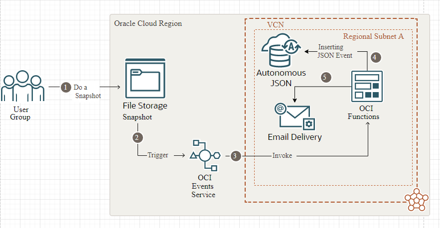
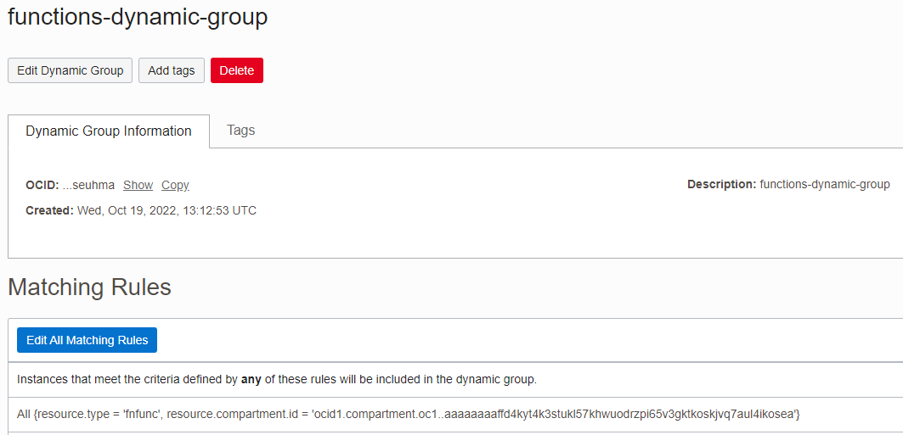
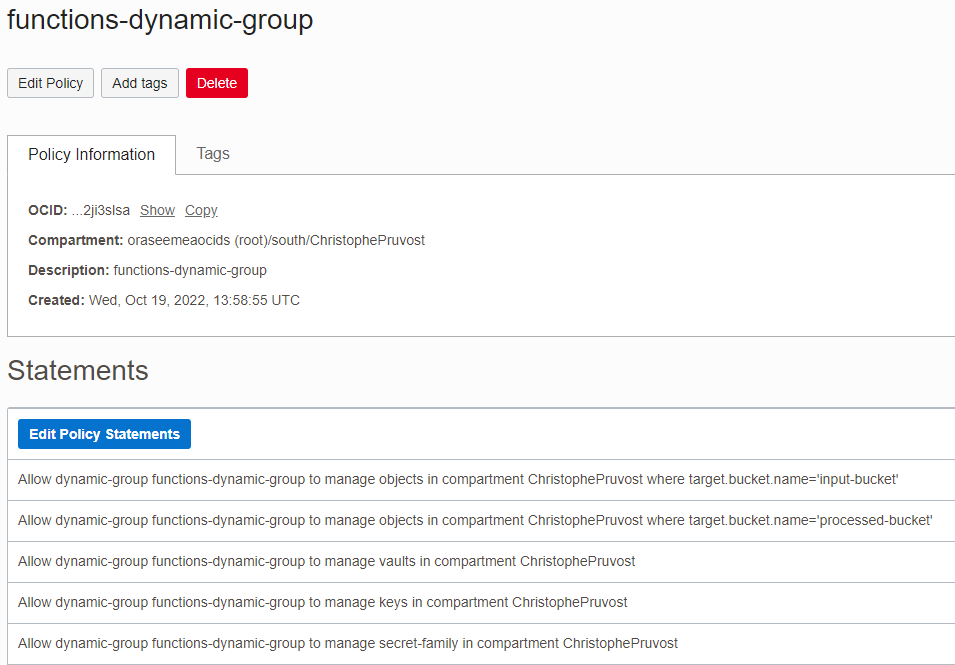
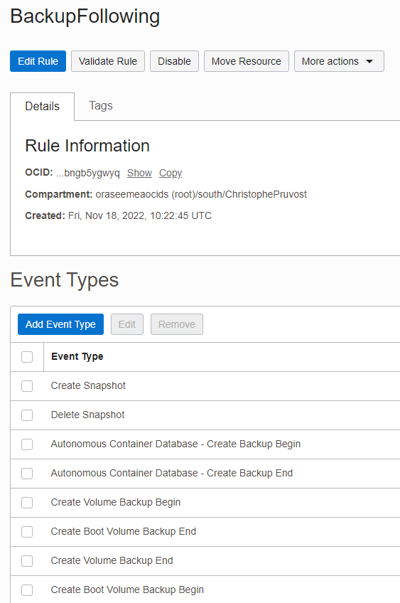
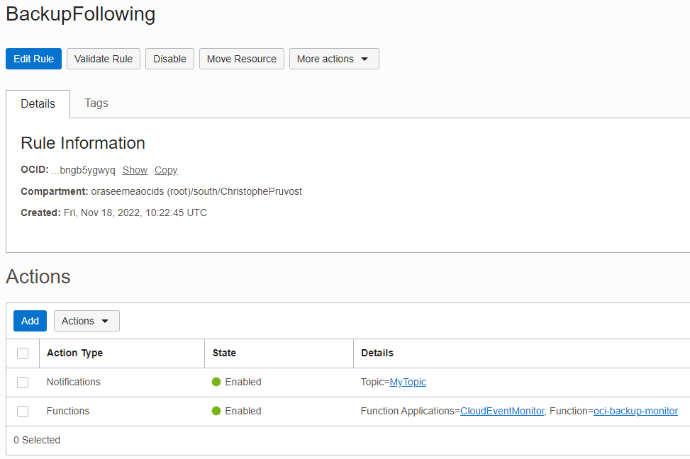
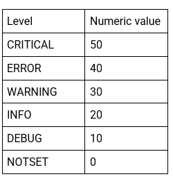
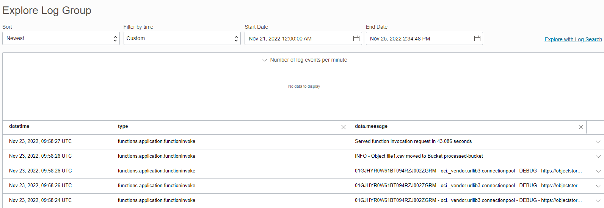
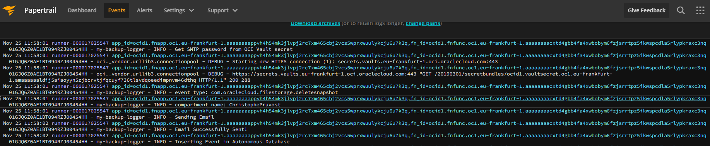
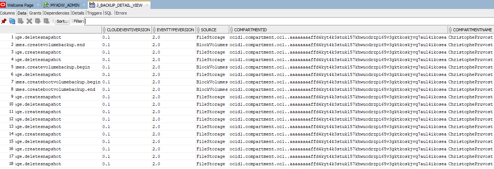
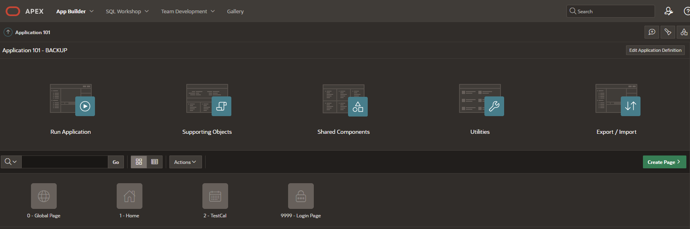

# Monitor Oracle Cloud Infrastructure Backups with Functions and Autonomous JSON.

This function does insert of Oracle Cloud Backup Events in Autonomous Db (Autonomous JSON is the best choice cause an event = json). This means you can build easily an APEX application to monitor all your backups on OCI in one place ! Then as an OCI administrator you avoid that to have an email box full and you can build efficient Backup Reports with APEX.



As you make your way through this tutorial, look out for this icon .
Whenever you see it, it's time for you to perform an action.


## Prerequisites
Before you deploy this sample function, make sure you have run step A, B and C of the [Oracle Functions Quick Start Guide for Cloud Shell](https://www.oracle.com/webfolder/technetwork/tutorials/infographics/oci_functions_cloudshell_quickview/functions_quickview_top/functions_quickview/index.html)
* A - Set up your tenancy
* B - Create application
* C - Set up your Cloud Shell dev environment
* D - You need to know how to use [SODA with Autonomous DB](https://apexapps.oracle.com/pls/apex/f?p=133:180:12822046735455::::wid:831)
* E - Look at 4 samples on [Oracle Github Functions Samples](https://github.com/oracle-samples/oracle-functions-samples/tree/master/samples) : oci-event-display-python, oci-sent-email-python, oci-load-file-into-adw-python, and oci-vault-get-secret-python

As you see you need to have some experience before using this Project because I do not explain the basics with functions. And mainly be carefull concerning the policies that allow Functions to access to Object Storage and Vault Secrets. 

Ex : The Dynamic Group

Ex : The Policies


## List Applications 
Assuming your have successfully completed the prerequisites, you should see your 
application in the list of applications.
```
fn ls apps
```

## Create or Update your Dynamic Group
In order to use other OCI Services, your function must be part of a dynamic group. For information on how to create a dynamic group, refer to the [documentation](https://docs.cloud.oracle.com/iaas/Content/Identity/Tasks/managingdynamicgroups.htm#To).

When specifying the *Matching Rules*, we suggest matching all functions in a compartment with:
```
ALL {resource.type = 'fnfunc', resource.compartment.id = 'ocid1.compartment.oc1..aaaaaxxxxx'}
```
Please check the [Accessing Other Oracle Cloud Infrastructure Resources from Running Functions](https://docs.cloud.oracle.com/en-us/iaas/Content/Functions/Tasks/functionsaccessingociresources.htm) for other *Matching Rules* options.


## Review and customize your function
Review the following files in the current folder:
* the code of the function, [func.py](./func.py)
* its dependencies, [requirements.txt](./requirements.txt)
* the function metadata, [func.yaml](./func.yaml)


## Deploy the function
In Cloud Shell, run the *fn deploy* command to build the function and its dependencies as a Docker image, 
push the image to OCIR, and deploy the function to Oracle Functions in your application.


```
fn -v deploy --app <app-name>
```

## Deploy the function configuration
In Cloud Shell, run the *fn config* command to build the configuration of the function. Use your own values !


```
Ex : With app-name=CloudEventMonitor
fn config function CloudEventMonitor oci-backup-monitor db-user admin (or another db user that you used for the demo)
fn config function CloudEventMonitor oci-backup-monitor db_pwd_secret_id ocid1.vaultsecret.oc1.eu-frankfurt-1.xxxx
fn config function CloudEventMonitor oci-backup-monitor ords-base-url https://xxxxx-myadw.adb.eu-frankfurt-1.oraclecloudapps.com/ords/
fn config function CloudEventMonitor oci-backup-monitor db-schema admin (or another db user that you used for the demo)
fn config function CloudEventMonitor oci-backup-monitor smtp-username ocid1.user.oc1..aaaaaaaarihby2lfahxsli7zj3bb3b6wobiouko3ky7ianie3lodhle6pfha@ocid1.xxxxx
fn config function CloudEventMonitor oci-backup-monitor email_smtp_pwd_secret_id ocid1.vaultsecret.oc1.eu-frankfurt-1.xxxx
fn config function CloudEventMonitor oci-backup-monitor smtp-host smtp.email.eu-frankfurt-1.oci.oraclecloud.com
fn config function CloudEventMonitor oci-backup-monitor smtp-port 587
fn config function CloudEventMonitor oci-backup-monitor log-level 40
```


## Create the Cloud Event rule
Create a Cloud Event rule on the console navigating to Application Integration > Event Service. Click *Create Rule*.



Assign a display name and a description, customize the Rule Conditions or leave them empty to match all events. In the *Actions* section, set the *Action type* as "Functions", select your *Function Compartment*, your *Function Application*, and your *Function ID*.



## Test
Choose the level of logging with the log level configuration. In configuration it will be stored as a String.



Go to the logs, you should see events from your compartment. You can create some backups like a File Storage Snapshot or a Block Volume Backup to generate an event.
Note that it means you followed the documentation to see the logs with OCI logging.



For example:
```json
event type: com.oraclecloud.filestorage.createsnapshot
compartment name: ChristophePruvost
Full Cloud event json data:
{
  "eventType" : "com.oraclecloud.filestorage.createsnapshot",
  "cloudEventsVersion" : "0.1",
  "eventTypeVersion" : "2.0",
  "source" : "FileStorage",
  "eventTime" : "2022-11-25T11:11:12Z",
  "contentType" : "application/json",
  "data" : {
    "compartmentId" : "ocid1.compartment.oc1..aaaaaaaaffd4kyt4k3stukl57khwuodrzpi65v3gktkoskjvq7aul4ikosea",
    "compartmentName" : "ChristophePruvost",
    "resourceName" : "Snapshot-20221125-1111-02",
    "resourceId" : "ocid1.snapshot.oc1.eu_frankfurt_1.aaaaaaaaaaaaaaawaaaaaaabdypqmztsmewxa4tpmq5gk5jnmzzgc3tlmz2xe5bngewwczbngiaaaaaa",
    "availabilityDomain" : "AD2",
    "freeformTags" : { },
    "definedTags" : {
      "Mandatory_Tags" : {
        "Owner" : "oracleidentitycloudservice/christophe.pruvost@oracle.com",
        "Schedule" : "OnDemand_UTC+1",
        "CreatedOn" : "2022-11-25T11:11:03.067Z"
      }
    },
    "additionalDetails" : {
      "X-Real-Port" : 60131
    }
  },
  "eventID" : "4bf2c7f6-f724-4449-84bd-3fbca7627344",
  "extensions" : {
    "compartmentId" : "ocid1.compartment.oc1..aaaaaaaaffd4kyt4k3stukl57khwuodrzpi65v3gktkoskjvq7aul4ikosea"
  }
}
```
You have another possibility for monitoring the logs : Papertrail. To do that you let the button enabled log on off for the function and you give the papertrail url to your application with : fn update app CloudEventMonitor --syslog-url tcp://logs4.papertrailapp.com:xxxx




## Monitoring Functions

Learn how to configure basic observability for your function using metrics, alarms and email alerts:
* [Basic Guidance for Monitoring your Functions](../basic-observability/functions.md)

## Build a web interface in order to request the events or to build reports

As we have stored the events in Autonomous with the json format, we can first create an Oracle Database View and then build the User Interface we want with APEX for ex. Nothing is more powerfull than that !

So first connect to Autonomous with SQLDeveloper and execute the j_backup_details_views.sql. Then you can request easily the view using SQL.



Then Build the Application you want to with APEX

