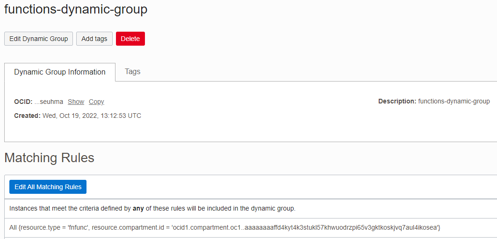
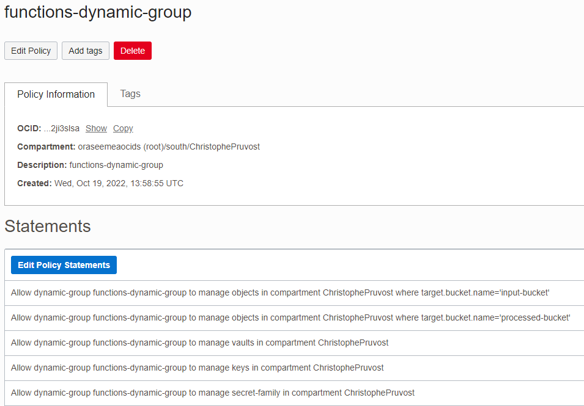
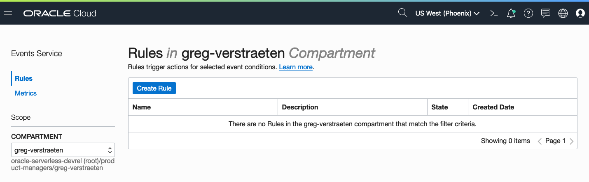
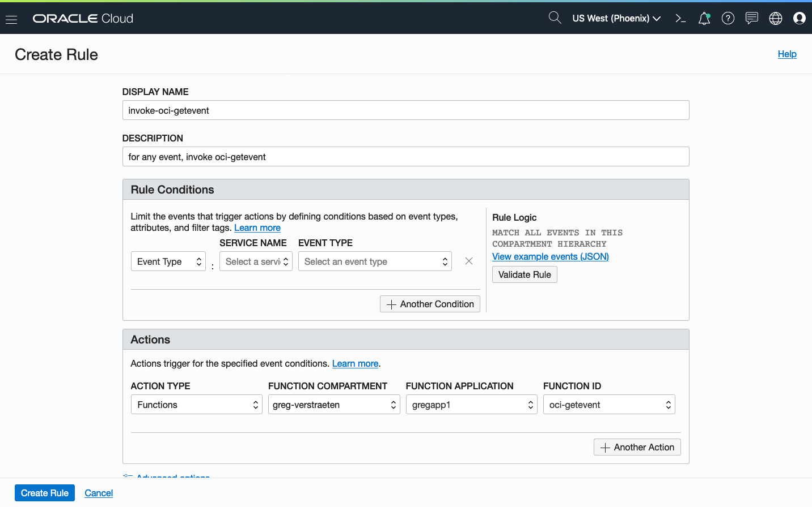

# Function that stores Oracle Cloud Events in Autonomous Db

This function does insert of Oracle Cloud Backup Events in Autonomous Db (Autonomous JSON is the best choice cause an event = json)

As you make your way through this tutorial, look out for this icon .
Whenever you see it, it's time for you to perform an action.


## Prerequisites
Before you deploy this sample function, make sure you have run step A, B and C of the [Oracle Functions Quick Start Guide for Cloud Shell](https://www.oracle.com/webfolder/technetwork/tutorials/infographics/oci_functions_cloudshell_quickview/functions_quickview_top/functions_quickview/index.html)
* A - Set up your tenancy
* B - Create application
* C - Set up your Cloud Shell dev environment
* D - You need to know how to use [SODA with Autonomous DB](https://apexapps.oracle.com/pls/apex/f?p=133:180:12822046735455::::wid:831)
* E - Look at 3 samples on [Oracle Github Functions Samples](https://github.com/oracle-samples/oracle-functions-samples/tree/master/samples) : oci-event-display-python, oci-sent-email-python, oci-load-file-into-adw-python, and oci-vault-get-secret-python

As you see you need to have some experiences before using this Project because I do not explain the basics with functions. And mainly be carefull concerning the policies that allow Functions to access to Object Storage and Vault Secrets. 

Ex : The Dynamic Group

Ex : The Policies


## List Applications 
Assuming your have successfully completed the prerequisites, you should see your 
application in the list of applications.
```
fn ls apps
```

## Create or Update your Dynamic Group
In order to use other OCI Services, your function must be part of a dynamic group. For information on how to create a dynamic group, refer to the [documentation](https://docs.cloud.oracle.com/iaas/Content/Identity/Tasks/managingdynamicgroups.htm#To).

When specifying the *Matching Rules*, we suggest matching all functions in a compartment with:
```
ALL {resource.type = 'fnfunc', resource.compartment.id = 'ocid1.compartment.oc1..aaaaaxxxxx'}
```
Please check the [Accessing Other Oracle Cloud Infrastructure Resources from Running Functions](https://docs.cloud.oracle.com/en-us/iaas/Content/Functions/Tasks/functionsaccessingociresources.htm) for other *Matching Rules* options.


## Review and customize your function
Review the following files in the current folder:
* the code of the function, [func.py](./func.py)
* its dependencies, [requirements.txt](./requirements.txt)
* the function metadata, [func.yaml](./func.yaml)


## Deploy the function
In Cloud Shell, run the *fn deploy* command to build the function and its dependencies as a Docker image, 
push the image to OCIR, and deploy the function to Oracle Functions in your application.


```
fn -v deploy --app <app-name>
```

## Deploy the function configuration
In Cloud Shell, run the *fn config* command to build the configuration of the function


```
Ex : With app-name=CloudEventMonitor
fn config function CloudEventMonitor oci-backup-monitor db-user admin
fn config function CloudEventMonitor oci-backup-monitor dbpwd-cipher xxxxx
fn config function CloudEventMonitor oci-backup-monitor ords-base-url https://xxxxx-myadw.adb.eu-frankfurt-1.oraclecloudapps.com/ords/
fn config function CloudEventMonitor oci-backup-monitor db-schema admin
fn config function CloudEventMonitor oci-backup-monitor smtp-username ocid1.user.oc1..aaaaaaaarihby2lfahxsli7zj3bb3b6wobiouko3ky7ianie3lodhle6pfha@ocid1.xxxxx
fn config function CloudEventMonitor oci-backup-monitor smtp-password "xxxxx"
fn config function CloudEventMonitor oci-backup-monitor smtp-host smtp.email.eu-frankfurt-1.oci.oraclecloud.com
fn config function CloudEventMonitor oci-backup-monitor smtp-port 587
fn config function CloudEventMonitor oci-backup-monitor log-level 40
```

## Create the Cloud Event rule
Create a Cloud Event rule on the console navigating to Application Integration > Event Service. Click *Create Rule*.



Assign a display name and a description, customize the Rule Conditions or leave them empty to match all events. In the *Actions* section, set the *Action type* as "Functions", select your *Function Compartment*, your *Function Application*, and your *Function ID*.



## Test
Go to the logs, you should see events from your compartment. You can create some resource such as an Object Storage bucket to generate an event.
For example:
```json
event type: com.oraclecloud.objectstorage.createbucket
compartment name: greg-verstraeten
Full Cloud event json data:
{
    "eventType": "com.oraclecloud.objectstorage.createbucket",
    "cloudEventsVersion": "0.1",
    "eventTypeVersion": "2.0",
    "source": "ObjectStorage",
    "eventTime": "2019-12-12T22:25:08.502Z",
    "contentType": "application/json",
    "data": {
        "compartmentId": "ocid1.compartment.oc1..aaaaaaaal66tw5k262fsjsrgdqan5cbbfxvoydbhxx5hijth2h3qlbwmtdlq",
        "compartmentName": "greg-verstraeten",
        "resourceName": "bucket-20191212-1425",
        "resourceId": "/n/devrel/b/",
        "availabilityDomain": "PHX-AD-2",
        "additionalDetails": {
            "bucketName": "bucket-20191212-1425",
            "publicAccessType": "NoPublicAccess",
            "namespace": "devrel",
            "eTag": "47b12898-1925-449a-a761-7d1db57f0695"
        }
    },
    "eventID": "fca0653f-85c5-9466-8812-001c51d338a4",
    "extensions": {
        "compartmentId": "ocid1.compartment.oc1..aaaaaaaal66tw5k262fsjsrgdqan5cbbfxvoydbhxx5hijth2h3qlbwmtdlq"
    }
}
```


## Monitoring Functions

Learn how to configure basic observability for your function using metrics, alarms and email alerts:
* [Basic Guidance for Monitoring your Functions](../basic-observability/functions.md)

